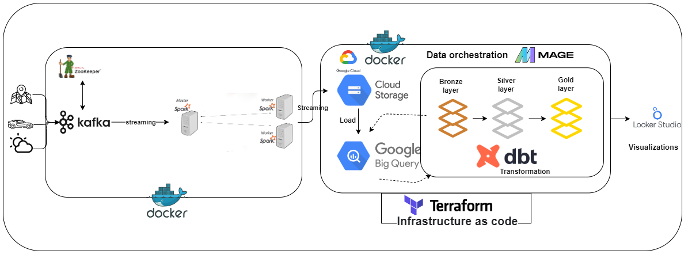
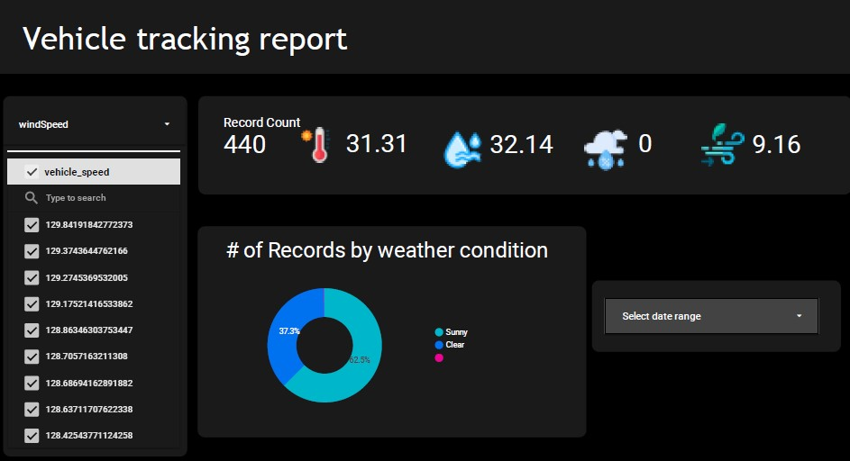

# Real-Time-Vehicle-Tracking-System

## Overview

This repository contains the implementation of a Real-Time Vehicle Tracking System using Kafka, ZooKeeper, Spark, Google Cloud Platform (GCS), BigQuery, Mage, Terraform, dbt, Docker, and Looker Studio. Follow this guide to set up and run the project to monitor and analyze vehicle data in real-time.

## Medium Article

For a detailed walkthrough and explanation of this project, please refer to my Medium article:

[Building a Real-Time Vehicle Tracking System with Kafka, ZooKeeper, Spark, GCS, BigQuery, Mage, Terraform, dbt, Docker, and Looker Studio](https://medium.com/@benabbou.osama/building-a-real-time-vehicle-tracking-system-with-kafka-zookeeper-spark-gcs-bigquery-mage-14f038f7ebe8)

### Architecture



## Requirements

- Python 3.6+
- Kafka
- ZooKeeper
- Apache Spark
- Google Cloud Platform (GCS, BigQuery)
- Mage
- Docker
- dbt
- Looker Studio

## Setup Instructions

### Create a service account (BigQuery Admin and Storage Admin) key

Rename the private key to keyfile.json, then move it to the keys folder in the root directory and the Mage root folder before running the project.

### Creating .env File

```bash
cd jobs
cp .env.example .env
```


### Setting Up the Infrastructure with Terraform

1. **Initialize Terraform:**
   ```bash
   terraform init
   ```
2. **Review the Plan:**
   ```bash
   terraform plan
   ```
3. **Apply the Plan:**
   ```bash
   terraform apply
   ```

### Setting Up the Project Environment

1. **Create a Virtual Environment:**
    ```bash
   python -m venv venv
   ```

2. **Activate the virtual environment:**
   On Windows:
    ```bash
   venv\Scripts\activate
   ```
   On macOS/Linux:
    ```bash
   source venv/bin/activate
   ```

3. **Install Dependencies:**
    ```bash
   pip install -r requirements.txt
   ```

### Running Docker Compose

**Start Docker containers for Zookeeper, Kafka, Spark Master, and Spark Workers:**
```bash
docker-compose up
```

### Simulating and Producing Real-Time Data

**Run Python Script:**
```bash
python jobs/main.py
```

### Running the Spark Job

**Submit the Spark job using the specified JAR and packages:**
```bash
spark-submit --jars path/to/gcs-connector-hadoop3-2.0.0-shaded.jar --packages org.apache.spark:spark-sql-kafka-0-10_2.12:3.4.1 jobs/spark_job.py
```

### Building and Running the Pipeline with Mage

**Build Docker Images:**
```bash
cd mage
docker-compose build
```

**Start Containers:**
```bash
docker-compose up -d
```
### Dashboard



[Dashboard](https://lookerstudio.google.com/s/rYEFcHV3Sg0)

## Acknowledgement

This course helped me on configuring Mage [course](https://github.com/DataTalksClub/data-engineering-zoomcamp). <br>
The project was inspired from this : https://youtu.be/Vv_fvwF41_0?si=fIBnzbyllYVv0-AV


